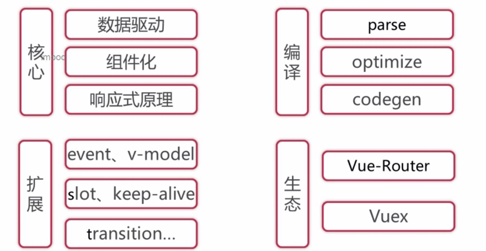

* **观看源码，切记不要想着一次性把每一步看清楚，一定要先理清主线 / 流程，再逐步瓦解**



* 数据驱动
Vue.js 的一个核心思想是数据驱动，即**视图是由数据驱动生成的，对视图的操作不会直接涉及 / 操作 DOM, 而是通过修改数据来实现操作视图(涉及到响应式原理)。** 相对于传统的前端开发（使用 jQuery/JavaScript 直接修改 DOM ）, 大大简化了代码量。尤其是当交互复杂是，只关心数据的修改会让代码逻辑变的非常清晰，因为 DOM 变成了数据的映射，所有的逻辑只针对数据的修改，而不触及 DOM, 同时有利于代码的维护。 

```js
initMixin -> initState(vm) //数据初始化

// target: vm, sourceKey: _data, key: message
export function proxy (target: Object, sourceKey: string, key: string) {
  sharedPropertyDefinition.get = function proxyGetter () {
    return this[sourceKey][key]
  }
  sharedPropertyDefinition.set = function proxySetter (val) {
    this[sourceKey][key] = val
  }

  /*
    将 target.key的访问，封装可一层getter 和 setter方法，即Target.key ==> this.sourceKey.key.
    即 vm.message ==> vm._data.message
  */
  Object.defineProperty(target, key, sharedPropertyDefinition)
}
```

* virtual DOM 的实现是参考了 **[snabbdom](https://github.com/snabbdom/snabbdom)**

## Flow
* 简介
    * vue 的源码并不是用纯`ES6`实现的，使用了`Flow(Facebook出品的JavaScript静态类型检查工具)`作为静态语法检查工具, 即在编译阶段今早发现由类型错误引起的bug。
    * 选用`Flow`, 主要因为`Babel`和`ESlint`都有对应的`Flow`插件以支持语法，可以完全沿用现有的构建配置, 这样可以减少改动成本
    * `JavaScript`是动态类型语言，灵活性很强，由此也会因其灵活性容易导致非常隐蔽的隐患代码，甚至编译期间不会报错，而运行阶段出现奇怪的bug

* Flow 工作方式（类型检查一般分为2种方式）
    * 类型推断：根据上下文推断变量类型
    * 类型注释：事先注释好变量类型 **(`a: number`)**
        ```js
        /*@flow*/

        //类型推断
        function split(str) {
            return str.split(' ')
        }

        split(11)

        //类型注释
        function add(x: number, y: number): number {
            return x + y
        }

        add('hello', 11)
        ```

* Flow 安装
    * 下载：`npm install -g flow-bin`
    * 创建`.flowconfig` &rarr; `flow init`
        **.flowconfig**：忽略哪些文件，引用哪些库文件等等配置
    * 需要检测的`.js`文件开头需要添加`/*@flow*/`，否则会跳过该文件，不检查
    * 执行当前目录下`.js`文件：`flow`

* Flow 第三方库
    * `libdef`概念，用于识别第三方库或者自定义类型，自定义类型的文件目录放于`[libs]`下

## rollup vs webpack
* 二者都是构建工具
* `webpack`相对更强大，其可以将除了`js`文件外的图片等也编译成`JavaScript`
* `rollup`更适合一种`JavaScript`库的一种编译，其只处理`js`部分，**优势**更轻量，编译后的代码相对更加友好

## vue
* vue 是发布在`NPM`上的，每一个`npm包`都有一个描述文件 &rarr; `package.json`
```json
{
    "name": "vue",

    // main 是 npm 包的一个默认入口，即当 import vue，
    // 通过这个 main 的入口去查找文件 
    "main": "dist/vue.runtime.common.js",

    // 类似于 main , webpack2 是把 module 作为默认入口
    "module": "dist/vue.runtime.esm.js",

    // 定义一系列 任务/脚本
    // npm run build   =>  node scripts/build.js
    // npm run test:types
    "script": {
        "build": "node scripts/build.js",
        "build:weex": "npm run build -- weex",
        "test:types": "tsc -p ./types/test/tsconfig.json",
    }
}
```

## Runtime + Only vs Runtime + Compiler
* `Runtime + Only (运行时不带编译，编译后体积相对小，编译是在离线阶段进行。 **推荐开发中使用**)

通常需要借助`webpack` 和 `vue-loader` 工具把`.vue`文件编译成`JavaScript`文件 **( `template`模板 编译&rarr; `render函数` )**

* Runtime + Compiler (运行时编译，对性能有一定损耗)

如果写 `template`属性，则需要编译成 render 函数则一定要使用`Compiler`版本
```js
// 需要编译器
new Vue({
    template: '<div>{{ hi }}</div>'
});

// 不需要编译器
new Vue({
    render (h) {
        return h('div', this.hi)
    }
});
```