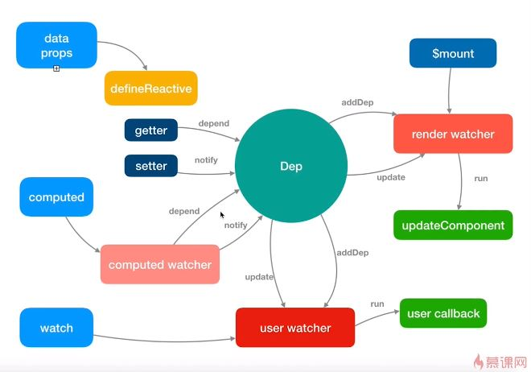

* **观看源码，切记不要想着一次性把每一步看清楚，一定要先理清主线 / 流程，再逐步瓦解**


* 数据驱动
Vue.js 的一个核心思想是数据驱动，即**视图是由数据驱动生成的，对视图的操作不会直接涉及 / 操作 DOM, 而是通过修改数据来实现操作视图(涉及到响应式原理)。** 相对于传统的前端开发（使用 jQuery/JavaScript 直接修改 DOM ）, 大大简化了代码量。尤其是当交互复杂是，只关心数据的修改会让代码逻辑变的非常清晰，因为 DOM 变成了数据的映射，所有的逻辑只针对数据的修改，而不触及 DOM, 同时有利于代码的维护。 

```js
initMixin -> initState(vm) //数据初始化

// target: vm, sourceKey: _data, key: message
export function proxy (target: Object, sourceKey: string, key: string) {
  sharedPropertyDefinition.get = function proxyGetter () {
    return this[sourceKey][key]
  }
  sharedPropertyDefinition.set = function proxySetter (val) {
    this[sourceKey][key] = val
  }

  /*
    将 target.key的访问，封装可一层getter 和 setter方法，即Target.key ==> this.sourceKey.key.
    即 vm.message ==> vm._data.message
  */
  Object.defineProperty(target, key, sharedPropertyDefinition)
}
```

* virtual DOM 的实现是参考了 **[snabbdom](https://github.com/snabbdom/snabbdom)**

## Flow
* 简介
    * vue 的源码并不是用纯`ES6`实现的，使用了`Flow(Facebook出品的JavaScript静态类型检查工具)`作为静态语法检查工具, 即在编译阶段今早发现由类型错误引起的bug。
    * 选用`Flow`, 主要因为`Babel`和`ESlint`都有对应的`Flow`插件以支持语法，可以完全沿用现有的构建配置, 这样可以减少改动成本
    * `JavaScript`是动态类型语言，灵活性很强，由此也会因其灵活性容易导致非常隐蔽的隐患代码，甚至编译期间不会报错，而运行阶段出现奇怪的bug

* Flow 工作方式（类型检查一般分为2种方式）
    * 类型推断：根据上下文推断变量类型
    * 类型注释：事先注释好变量类型 **(`a: number`)**
        ```js
        /*@flow*/

        //类型推断
        function split(str) {
            return str.split(' ')
        }

        split(11)

        //类型注释
        function add(x: number, y: number): number {
            return x + y
        }

        add('hello', 11)
        ```

* Flow 安装
    * 下载：`npm install -g flow-bin`
    * 创建`.flowconfig` &rarr; `flow init`
        **.flowconfig**：忽略哪些文件，引用哪些库文件等等配置
    * 需要检测的`.js`文件开头需要添加`/*@flow*/`，否则会跳过该文件，不检查
    * 执行当前目录下`.js`文件：`flow`

* Flow 第三方库
    * `libdef`概念，用于识别第三方库或者自定义类型，自定义类型的文件目录放于`[libs]`下

## rollup vs webpack
* 二者都是构建工具
* `webpack`相对更强大，其可以将除了`js`文件外的图片等也编译成`JavaScript`
* `rollup`更适合一种`JavaScript`库的一种编译，其只处理`js`部分，**优势**更轻量，编译后的代码相对更加友好

## vue
* vue 是发布在`NPM`上的，每一个`npm包`都有一个描述文件 &rarr; `package.json`
```json
{
    "name": "vue",

    // main 是 npm 包的一个默认入口，即当 import vue，
    // 通过这个 main 的入口去查找文件 
    "main": "dist/vue.runtime.common.js",

    // 类似于 main , webpack2 是把 module 作为默认入口
    "module": "dist/vue.runtime.esm.js",

    // 定义一系列 任务/脚本
    // npm run build   =>  node scripts/build.js
    // npm run test:types
    "script": {
        "build": "node scripts/build.js",
        "build:weex": "npm run build -- weex",
        "test:types": "tsc -p ./types/test/tsconfig.json",
    }
}
```

## Runtime + Only vs Runtime + Compiler
* `Runtime + Only (运行时不带编译，编译后体积相对小，编译是在离线阶段进行。 **推荐开发中使用**)

通常需要借助`webpack` 和 `vue-loader` 工具把`.vue`文件编译成`JavaScript`文件 **( `template`模板 编译&rarr; `render函数` )**

* Runtime + Compiler (运行时编译，对性能有一定损耗)

如果写 `template`属性，则需要编译成 render 函数则一定要使用`Compiler`版本
```js
// 需要编译器
new Vue({
    template: '<div>{{ hi }}</div>'
});

// 不需要编译器
new Vue({
    render (h) {
        return h('div', this.hi)
    }
});
```

## Vue 生命周期
Create 钩子函数可以访问到数据
父 create > 子Create  
父 beforeDestoryed > 子 beforeDestoryed
Mount 钩子函数中是可以访问 DOM 的
子 mount > 父 mount
子 destoryed > 父 destoryed

## 异步组件 （三种方式）
* require 方式（工厂函数）
    ```js
    Vue.component('HelloWorld', function(resolve, reject) {
        //这个特殊的 require 语法告诉 webpack 自动编译后的代码分割成不同的块
        require(['./component/HelloWorld.vue'], function(res) {
            resolve(res)
        });
    })
    ```

* import 方式(Promise) --> 配合 webpack
    ```js
    Vue.component('HelloWorld',
    //该 'import' 函数会返回一个 'Promise' 对象
    () => import('./component/HelloWorld.vue'));
    ```

* 高级异步组件
    ```js
    const LoadingComp = {
        template: '<div>loading</div>'
    }

    const ErrorComp = {
        template: '<div>error</div>'
    }

    const AsyncComp = () => ({
        //需要加载的组件，应该是一个 Promise
        component: import('./component/HelloWorld.vue'),

        //加载中应当渲染的组件
        loading: LoadingComp,

        //出错时渲染的组件
        error: ErrorComp,

        //渲染加载中的组件前等待时间，默认: 200ms
        delay: 200,

        //最长等待时间，超出此时间则渲染错误组件，默认: Infinity
        timeout: 1000
    })

    Vue.component('HelloWorld', AsyncComp)
    ```
* **异步组件实现的本质是2次及以上渲染（通常为 2 次），先渲染成注释节点，当组件加载成功后，再通过<font color="red">forceRender(forceUpdate)</font> 重新渲染**

* **异步组件三种实现方式中，高级异步组件的设计非常巧妙的，它可以通过简单的配置实现了loading、resolve、reject、timeout 四种状态**


## 响应式原理
* 核心 &rarr; ES5 的 `Object.defineProperty` 为对象属性添加 getter 和 setter 方法
* Vue 会把 props, data, compute 等等变成响应式的
* 访问对象后，就会执行 `Object.defineProperty`里面的 get 方法， 修改它就会执行 set 方法

## 依赖收集 即订阅数据变化的 watcher 的收集
* **Dep 对象作用：建立数据和 Watcher之间的桥梁**
* 当触发 get 函数，就会把当前的 Watcher 收集起来当作一个订阅者
* 目的是为了当这些响应式数据发送变化，触发它们的 setter 的时候，能知道应该通知哪些订阅者去做响应的逻辑处理

## 派发更新
* 当数据发生变化后，通知所有订阅了这个数据变化的 Watcher 执行 update
* 优化：派发更新过程中会把所有要执行 update 的 watcher 推到队列中，在 nextTick后执行 flush

## JS 运行机制
* 基于循环事件；单线程；
* 事件循环
    1. 所有同步任务在主线程执行，形成一个"执行栈"
    2.  主线程之外，还存在一个"任务队列（task queue）"，当异步任务有结果后，就会在 "任务队列" 中放置一个事件
    3.  一旦执行栈中的所有同步任务执行完毕，系统就会读取"任务队列",查询有哪些事件，将哪些结束的处于等待状态的异步任务，放入执行栈，开始执行
    4. 主线程不断重复上面第三步骤
* 主线程的执行过程就是一个 **tick**, 消息队列中存放的是一个个的任务 (task)。
* task
    * macro task (每个 macro task 结束后，都要清空所有的 micro task )
    * micro task
* 在浏览器环境中
    * 常见的 macro task 有 setTimeout, MessageChannel, postMessage, setImmediate;
    * 常见的 micro task 有 Mutation Observer 和 Promise.then

## nextTick
* nextTick 是把**要执行的任务推入到一个队列中**，在下一个 **tick** 同步执行
* 数据改变后触发渲染 watcher 的 update， 但是 watchers 的 flush是在 nextTick后，所以重新渲染是异步的

## Tip
* Vue2.x 响应式数据中对于 对象新增，删除属性以及数组的下标访问修改，添加数据的变化是监测不到的
    * 原因：对象是引用类型，所以只会监测到这个引用的值或者说是地址
    * 解决：通过 Vue.set 以及数组的API解决；本质是内部手动做了依赖更新的派发 (childOb.dep.depend())和通知 (ob.dep.notify())
    ```js
    data() {
        return {
            msg: {
                a: 'Hello'
            },
            items: [1, 2]
        }
    }
    methods: {
        change() {
            //this.items[1] =3   //无效，监测不到

            Vue.set(this.items, 1, 3)
        }

        add() {
            //this.msg.b = 'Vue' //无效，监测不到
            //this.items[2] = 4 //无效，监测不到

            Vue.set(this.msg, 'b', 'Vue')
            this.items.push(4)   //数组API
        }
    }
    ```
## $set, Vue.set 和 Object.assign 区别
* $set 会直接更新视图, 而 Object.assign 则不会，需要建立一个空对象才能实时更新 ( ```Object.assign({},this.obj, {a: 55})```)
* Vue.set 可以设置实例创建之后添加的新的属性, (在data里未声明的属性), 而 this.$set 只能设置实例创建后存在的属性。

## 计算属性(compute) 和 监听属性
* 计算属性适合用在模板渲染中；监听属性适用于观测某个值变化从而完成一段复杂的业务逻辑
#### compute
* 本质是通过 computed watcher 实现的
* vue 2.57 以后 compute 每次都会触发 `getAndInvoke`函数作比较，数据是否有改变，有变化才会去触发重新渲染。概括来说，就是之间是计算少多次渲染，新版本是多次计算少渲染
#### watch
* 本质是通过 user watcher, 它还支持 deep, sync 和 immediate等配置

## 组件更新
* 观察数据变化，数据更新后能通知到观察者
* 核心过程是 新旧 vnode diff，对新旧节点相同及不同的情况做不同处理
    * 新旧节点不同更新流程：创建新节点 &rarr; 更新父占位符节点 &rarr; 删除旧节点
    * 新旧节点相同更新流程: 获取它们的children, 根据不同情况做不同逻辑更新


## Props